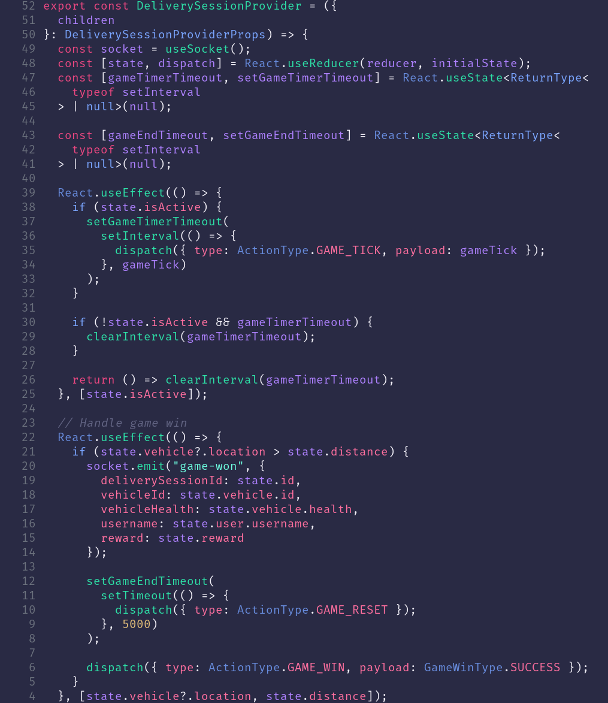

# gloombuddy

Gloom inspired theme for neovim using [colorbuddy](https://github.com/tjdevries/colorbuddy.nvim).



## Installation

### Vim Plug

```vim
Plug 'tjdevries/colorbuddy.vim'
Plug 'bkegley/gloombuddy'

" in your init.vim
colorscheme gloombuddy
" or
lua require'colorbuddy'.colorscheme('gloombuddy')

```

## Todo

Highlighting currently relies heavily on treesitter. We should implement language specific highlighting
for those that aren't using treesitter.
